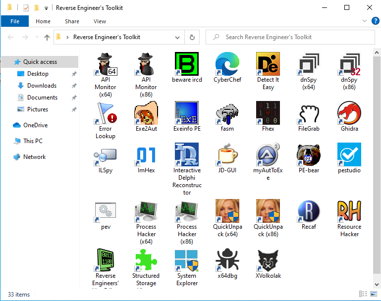

# Reverse Engineer's Toolkit

## What?

This is a collection of tools you may like if you are interested on reverse engineering and/or malware analysis on x86 and x64 Windows systems. After installing this toolkit you'll have a folder in your desktop with shortcuts to RE tools like these:

## Why do I need it?

You don't. Obviously, you can download such tools from their own website and install them by yourself in a new VM. But if you download retoolkit, it can probably save you some time. Additionally, the tools come pre-configured so you'll find things like x64dbg with a few plugins, command-line tools working from any directory, etc. You may like it if you're setting up a new analysis VM.

## Download

The *.iss files you see here are the source code for our setup program built with [Inno Setup](https://jrsoftware.org/isinfo.php). To download the real thing, you have to go to the [Releases](https://github.com/mentebinaria/retoolkit/releases) section and download the setup program.

## Included tools

## Is it safe to install it in my environment?

I don't know. Some included tools are not open source and come from shady places. You should use it exclusively in virtual machines and under your own responsibility.
